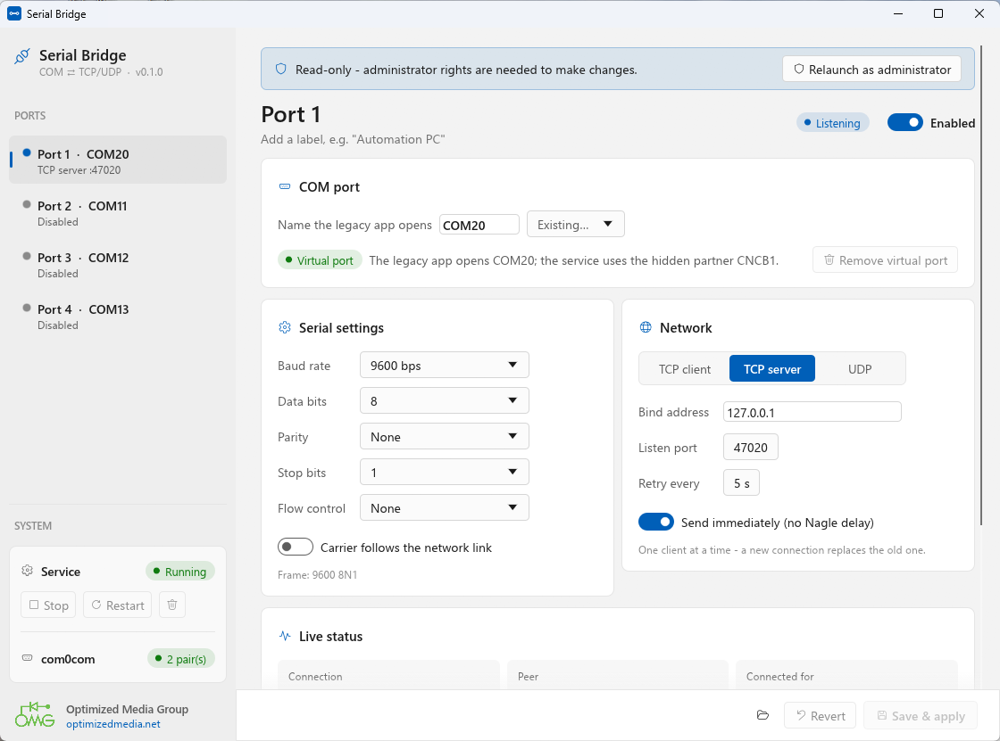
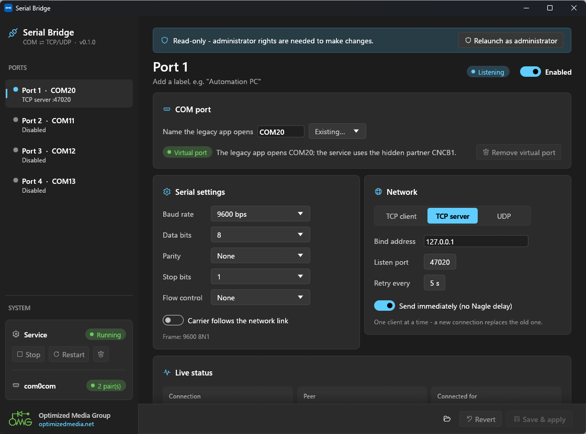

# Serial Bridge

**Give RS-232-only software a COM port that really talks TCP or UDP.**

Serial Bridge creates up to four virtual COM ports on Windows (or uses real ones) and connects
each one, in both directions, to a TCP client, a TCP server or a UDP endpoint. Legacy
applications keep opening `COM10` as they always have. The data travels over the network to a
serial device server, another PC or a modern system.



## Download

**[⬇ Serial Bridge 0.1.0 installer](https://github.com/goobenet/serialbridge/releases/download/v0.1.0/SerialBridge-Setup-0.1.0.exe)**
(Windows 10/11, 64-bit). All versions are on the [Releases](https://github.com/goobenet/serialbridge/releases) page.

Everything is code-signed by **Optimized Media Group LLC** (EV certificate).

## Features

- **Up to 4 ports**, each bridged independently:
  - **TCP client:** dials out and reconnects automatically.
  - **TCP server:** listens for one client; a new connection replaces the old one.
  - **UDP:** a fixed remote, or reply to whoever sent last.
- **Full serial settings:** 1200 to 115200 baud, 5 to 8 data bits, None/Odd/Even/Mark/Space
  parity, 1/1.5/2 stop bits, and RTS/CTS, DTR/DSR or XON/XOFF flow control.
- **Virtual COM ports in one click.** The installer includes the com0com driver, and the app
  creates and removes ports for you. It works with real/USB serial ports too.
- **Real line behaviour:** data reaches the legacy app at the configured baud rate, and
  hardware flow control works end to end. Optionally, the app sees carrier (DSR/DCD) only
  while the network link is up.
- **Runs as a Windows service** that starts with Windows and recovers from dropped links and
  unplugged devices. Setting changes apply in about a second without disturbing other ports.
- **Live status** for each port: connection state, peer, uptime, and traffic in each direction.
- Light and dark mode, following Windows.



## Install

1. Run **`SerialBridge-Setup-0.1.0.exe`** and approve the Windows prompt. It should show
   *Verified publisher: Optimized Media Group LLC*.
2. Keep the defaults. Setup installs the app and its service, and the virtual COM port driver
   if it isn't already present.
   When the driver installs, Windows asks whether to trust software from
   **"Steven William Hatchett"** (the driver's publisher). Click **Install**.
3. On the last page, leave **Open Serial Bridge now** ticked.

Then set up a port:

1. Pick a port on the left.
2. Enter the COM name your software uses, e.g. `COM10`. If it doesn't exist yet, click
   **Create virtual COM10**.
3. Set the serial parameters and choose the network side.
4. Turn on **Enabled** and click **Save & apply**.

Upgrading: run the new installer over the old one. Your settings are kept.
Uninstalling: use *Settings → Apps*. It asks whether to keep your port settings.

A **portable zip** with the same signed files is also on the release page. Run
`serialbridge.exe` as administrator and use *Install com0com* and *Install service* in the app.

## Verify your download

Each release includes `SHA256SUMS.txt`. In PowerShell:

```powershell
Get-FileHash .\SerialBridge-Setup-0.1.0.exe
```

v0.1.0:

```
da1ae483240dd88ca24cf7298a1c6e71a93554c90fcf57fc9d9b0517c1a6881e  SerialBridge-Setup-0.1.0.exe
fad56d1a2426b2d03cd1434c88c7bb67b6c42c3d77d337f0cc01a9e0466c1d92  SerialBridge-0.1.0-portable.zip
```

## Requirements and notes

- Windows 10 or 11, 64-bit. Tested on Windows 11 with Secure Boot and Memory Integrity on.
- Virtual ports use **com0com 2.2.2.0**. The newer "signed" com0com 3.0 is rejected by Windows
  when Secure Boot is on (Device Manager Code 52). Setup detects 3.x and replaces it.
- Settings and logs are stored in `C:\ProgramData\SerialBridge\`.

## Third-party components

- **com0com** (virtual null-modem driver) by Vyacheslav Frolov. GPL-2.0-or-later, shipped
  unmodified. Its complete source and the GPL text are included in the installer and zip
  (`com0com\`). Homepage: <http://com0com.sourceforge.net/>.
- **Fluent UI System Icons** by Microsoft (MIT), and the **Selawik** font by Microsoft
  (SIL OFL 1.1).

Full notices are in `THIRD-PARTY.txt`, installed next to the program.

---

© Optimized Media Group · [optimizedmedia.net](https://optimizedmedia.net)
